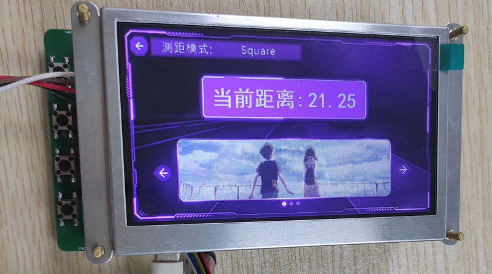
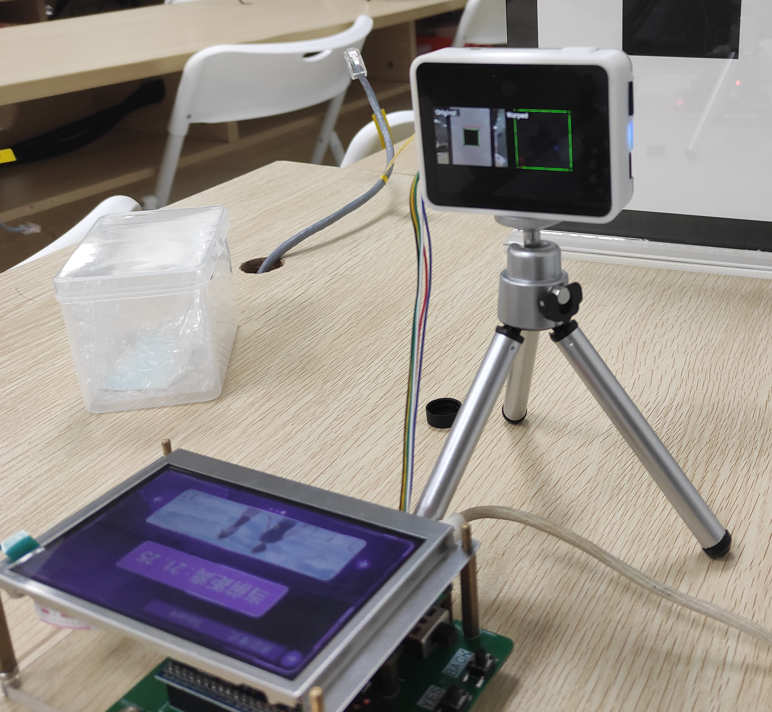
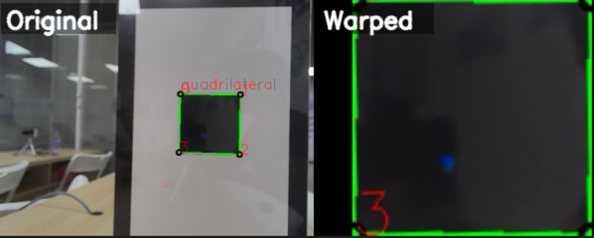

# 基于STM32与MaixCam的视觉测距交互系统
📷 基于MaixCamPro单目视觉+STM32单片机+陶晶驰TJC串口屏的单目测距综合实训项目，完整实现**图像采集→轮廓识别→单目测距→串口通信→嵌入式解析→串口屏可视化**全链路机器视觉嵌入式工程。

## 核心功能
1. MaixCam端：HSV黑色阈值分割、轮廓筛选、多边形判定（三角形/四边形/杂形）
2. 四点坐标标准化排序、透视变换矫正倾斜物体俯视图
3. 相似三角形单目测距，串口防抖+节流防单片机阻塞
4. 自定义串口帧协议 `$D:距离放大值,W:像素宽,H:像素高#\r\n`
5. STM32串口中断接收、数据帧解析、数值预处理
6. 陶晶驰TJC串口屏动态刷新距离、物体尺寸、识别图形
7. 双画面可视化输出：原图+矫正俯视图同屏显示

## 仓库目录结构
```
project/
├── LICENSE                 # 开源协议
├── README.md               # 项目说明文档
├── maixcam_app/            # MaixCam基础调试脚本（测试用）
├── maix_vision/            # MaixCam最终稳定上线代码（main_release.py）
├── stm32_keil/             # STM32 Keil MDK工程，串口数据解析逻辑
├── tjc_hmi/                # 陶晶驰TJC串口屏上位机界面工程文件
└── screenshot/             # 项目截图资源
```

## 项目实拍展示
### 1. 串口屏显示效果


### 2. 整机硬件实物


### 3. 相机视觉调试界面


## 软硬件环境
### 硬件清单
- 视觉模块：MaixCamPro 智能单目相机
- 主控单片机：STM32F103C8T6
- 显示模块：陶晶驰T1系列4.3寸串口屏
- 辅助配件：USB-TTL、杜邦线、ST-LINK下载器、标定黑色矩形靶标

### 软件环境
1. MaixCam端
   - Python3 + OpenCV + NumPy + Maix官方SDK
2. STM32端
   - Keil MDK5 + STM32CubeMX
3. 串口屏端
   - 陶晶驰TJC上位机HMI设计软件
4. 调试工具：XCOM串口调试助手、示波器

## 各文件夹代码说明
### 1. maix_vision（最终成品代码）
存放稳定交付版本 `main_release.py`，参数完成标定、防抖节流逻辑完善、异常捕获齐全，正式整机联调使用。
- 全局标定参数：物体真实宽度、像素焦距、串口发送间隔
- 硬件初始化：摄像头、显示屏、UART0串口
- HSV黑色目标分割、轮廓提取与噪声过滤
- 四点排序透视矫正、单目测距算法
- 串口协议封装、防抖节流、双画面拼接显示

### 2. maixcam_app（最终编译APP）
MaixVision编译的稳定交付版本APP，可以直接烧录进MaixCamera并运行。

### 3. stm32_keil（STM32底层工程）
- USART串口中断接收模块，解析`$D:xxx,W:xxx,H:xxx#`协议帧
- 数据合法性校验、数值转换
- 陶晶驰串口屏指令封装，动态刷新测距数据
- 硬件异常容错处理

### 4. tjc_hmi（串口屏工程）
陶晶驰上位机工程文件，包含静态文字、动态数值控件，接收STM32下发数据实时刷新界面。

## 快速部署流程
### 步骤1：MaixCam视觉程序部署
1. 将`maix_vision/main_release.py`上传至MaixCamPro开发板
2. 修改全局标定参数 `REAL_WIDTH_CM`、`FOCAL_LENGTH`（根据实物重新标定）
3. 调整`SEND_INTERVAL_MS`串口发送间隔，适配单片机响应速度
4. 运行脚本，查看屏幕双画面输出，确认四边形识别正常

### 步骤2：STM32工程编译下载
1. 使用Keil MDK打开`stm32_keil`工程
2. 配置串口波特率115200，与MaixCam串口匹配
3. 编译下载至STM32开发板

### 步骤3：串口屏界面烧录
1. 打开`tjc_hmi`内HMI工程，连接串口屏
2. 下载界面程序至陶晶驰T1屏幕

### 步骤4：硬件接线与整机联调
1. MaixCam UART0 TX → STM32 USART RX
2. STM32 TX → 陶晶驰串口屏RX
3. 共地供电，上电运行，串口屏实时显示测距数据

## 串口通信协议说明
### 发送帧格式（MaixCam → STM32）
```
$D:{距离放大整数},W:{物体像素宽},H:{物体像素高}#\r\n
```
- `D`：测距值 × 100 转为整数传输，减少浮点通信误差
- `W`：目标四边形像素宽度
- `H`：目标四边形像素高度
- 起始符`$`、结束符`#`方便单片机快速分割帧，过滤乱码杂波

### 防抖发送逻辑
同时满足两个条件才发送数据：
1. 距离上一次发送超过200ms（可配置）
2. 物体像素宽度前后帧变化大于3像素，小幅抖动不触发上报

## 标定说明（测距精度关键）
1. 固定黑色矩形靶标，测量真实物理宽度`REAL_WIDTH_CM`
2. 将靶标放置固定已知距离，采集画面中物体像素宽度
3. 通过公式 `FOCAL_LENGTH = distance_cm * pixel_width / REAL_WIDTH_CM` 计算焦距并填入代码